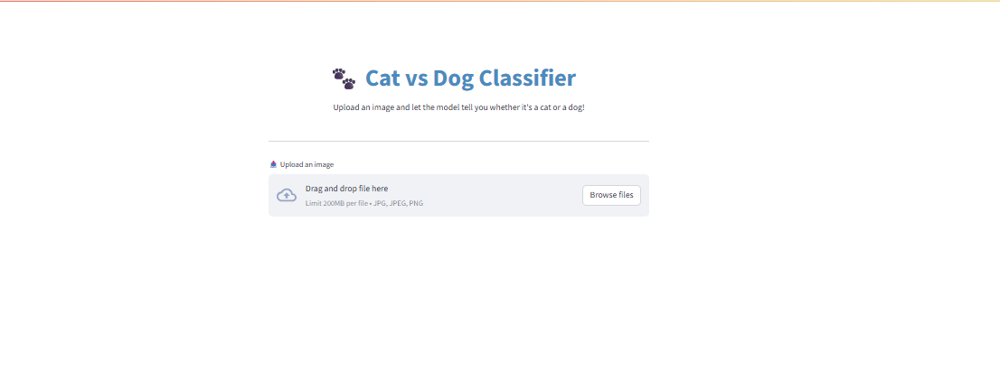
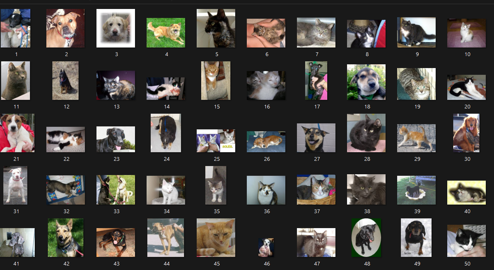
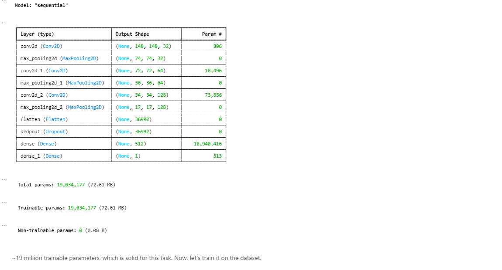
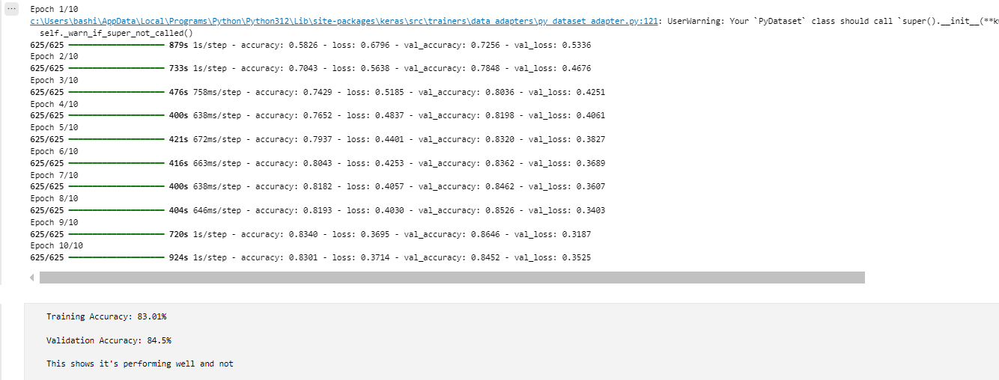
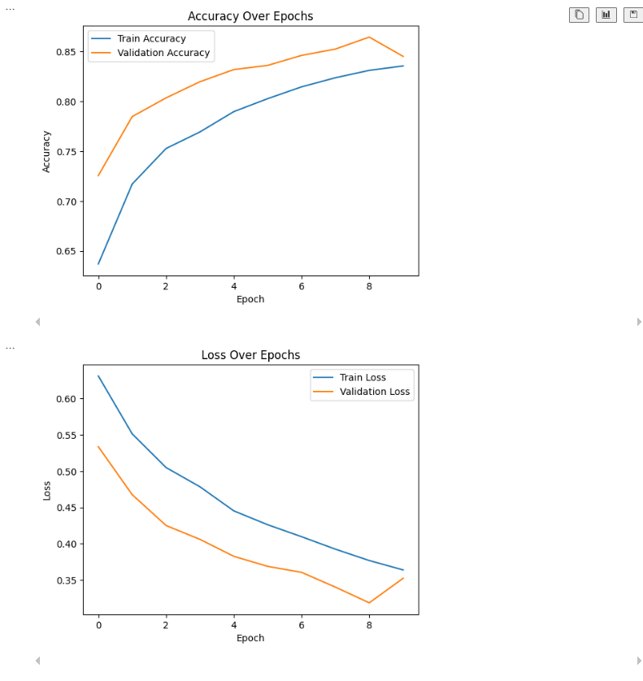
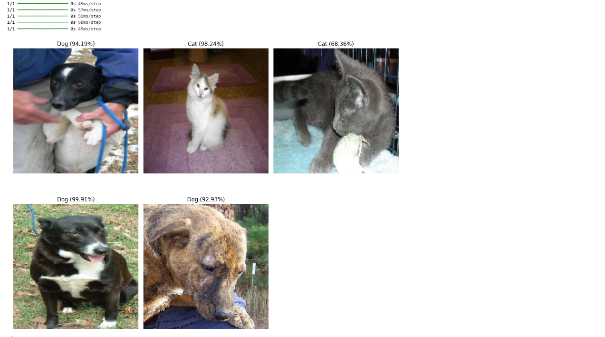
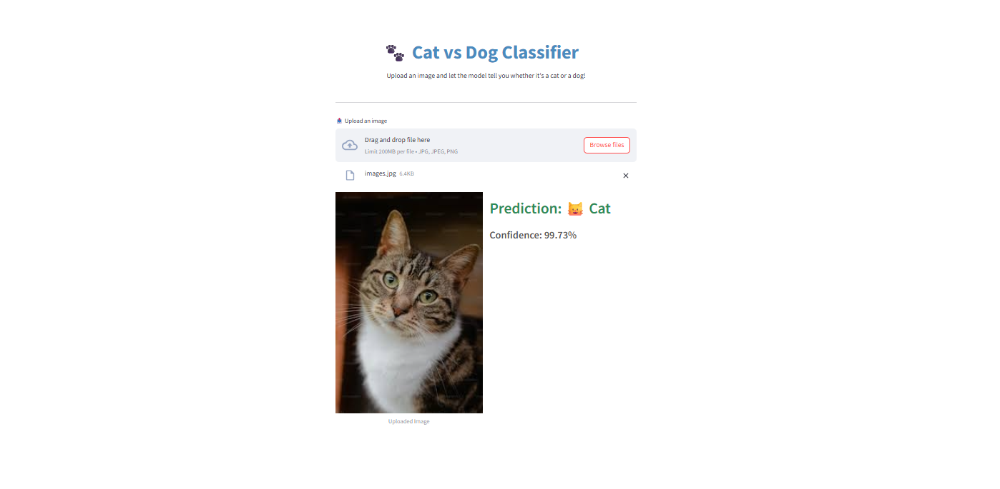

# Project : Cat vs Dog Image Clasifier

Author : Muhammad Fahad Bashir 

---
Table of Contents
- [Project : Cat vs Dog Image Clasifier](#project--cat-vs-dog-image-clasifier)
  - [About the Project:](#about-the-project)
  - [Dataset Description](#dataset-description)
  - [Model Architecture](#model-architecture)
  - [Results](#results)
    - [Training Summary](#training-summary)
    - [Learning Behavior\*\*](#learning-behavior)
    - [Model Testing](#model-testing)
  - [Web App Deployment](#web-app-deployment)
  - [Conclusion](#conclusion)
  - [Future Work](#future-work)

---

* [Notebook](./catvsdog.ipynb)
* [Streamlit App](./app.py)

## About the Project:
This project is part of an assignment for a course " **Python & AI Bootcamp**" organized by ICODEGURU. The project is a simple image classifier that can classify images of cats and dogs. The classifier uses CNN (Convolutional Neural Network) architecture and is trained on a dataset of images of cats and dogs.

[Task Detail](./CNN%20task.pdf)

## Dataset Description
Model is trained on a dataset named Cat vs Dogs from Kaggle.This dataset contain two folder.
1. **Test** 
   - 12500 images of cats & dogs for testing the model.
2. **Train** 
   - contain 25000 total image of both cats & dogs. 
   - 12500 images of cats and 12500 images of dogs.

[Dataset Link](https://www.kaggle.com/datasets/biaiscience/dogs-vs-cats)

## Model Architecture
The core of this project is a Convolutional Neural Network (CNN) designed to classify input images as either Cat or Dog. CNNs are highly effective for image classification tasks due to their ability to automatically learn spatial hierarchies of features through convolutional layers.

The architecture of the model is built using the following key layers:

* **Input Layer** : The input to the model is an image resized to 150x150 pixels with 3 color channels (RGB) & THEN normalized

* **Convolutional Layers** : Multiple Conv2D layers are used with increasing filter sizes (e.g., 32, 64, 128).Each convolution layer uses the ReLU activation function to introduce non-linearity.
* **Pooling Layers**: MaxPooling2D layers follow each convolutional block to reduce the spatial dimensions and computational load.

* **Flattening Layer** After the convolutional and pooling layers, the feature maps are flattened into a 1D vector to be fed into the dense layers.

* **Fully Connected (Dense) Layers** : One or more dense layers are used with ReLU activation to learn complex combinations of features extracted earlier.

* **Output Layer** : A final Dense layer with sigmoid activation function outputs two probabilities—one for Cat and one for Dog.

The class with the highest probability is selected as the model's prediction.

## Results
The performance of the Convolutional Neural Network (CNN) model was evaluated using training and validation accuracy metrics after several epochs of training.

### Training Summary
* **Training Accuracy**: 83.01%
* **Validation Accuracy**:  84.5%

### Learning Behavior**
The accuracy steadily increased across epochs, and the loss decreased smoothly.

### Model Testing
When tested on unseen images of cats and dogs, the model accurately predicted the class.

## Web App Deployment
The trained model was then implemented for users  using Streamlit, allowing users to upload an image and instantly receive predictions.

The interface displays:

* The uploaded image
* The predicted class (Cat or Dog)
* A confidence score in percentag

## Conclusion

This project successfully demonstrates the development and deployment of a Convolutional Neural Network (CNN) model for classifying images of cats and dogs. The model achieved a strong performance with a training accuracy of 84.5% and validation accuracy of 86.2%, indicating effective learning and minimal overfitting.

The trained model was integrated into a Streamlit web application, allowing users to interact with it by uploading images and receiving real-time predictions with confidence scores. 

Overall, this project contains the steps

* Building and training a CNN from scratch

* Saving and loading trained models

* Creating an interactive user interface for real-world use

## Future Work
This project can be extended to more complex image classification tasks or multi-class problems.Future enhancements like data augmentation, model optimization, or transfer learning for even higher accuracy can also be implemented this. 

---

